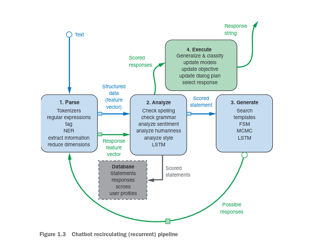

## Intro to NLP:

### 1.1 Natural Language vs programming language:


- DEFINITION:

        Natural language processing is an area of research in computer science and artificial intelligence (AI) concerned with processing natural languages such as English or Mandarin. This processing generally involves translating natural language into data (numbers) that a computer can use to learn about the world. And this understanding of the world is sometimes used to generate natural language text that reflects that understanding


### Regex notes:

- [ ]: is used to define a white space
- -: is used to define a range 


### Bag of words surprisingly can hadnle the task well

- They are good enaugh for many tasks such as spam filters 
- Python counter:

```python
from collections import counter

counter("Guten Morgen Rosa".split())

// counter({'Guten': 1. 'Morgen': 1, 'Rosa': 1})

```

### 1.7 A chatbot Natural Language Pipeline:

A chat bor requires four kinds of processing as well as a database to maintain a history of past statements and responses:

1. Parse: extract features from the nl text
2. Analyse: Generate and combine features by scoring text for sentimentm gramaticality, and semantics
3. Generate: Compose possible respinses using templeates, search, language models
4. Execute: Plan statements based on conversation history and objectives and select the next responses





[Next Page](../Chapter2/index.md)