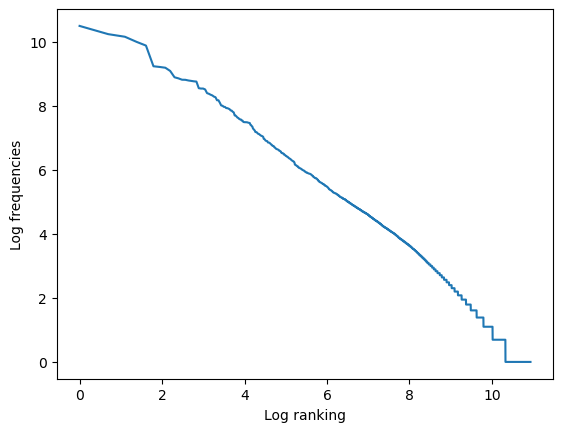
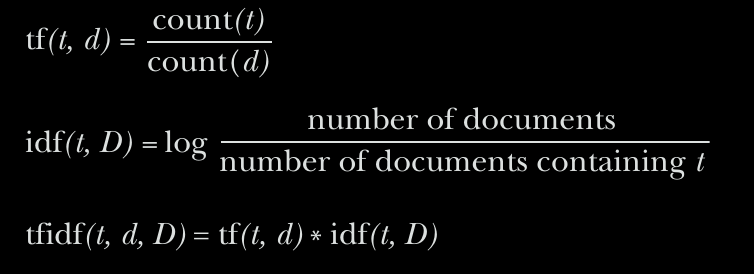

# Intro:

Having collected and counted words (tokens), and bucketed them into stems or lem-
mas, it’s time to do something interesting with them. Detecting words is useful for
simple tasks, like getting statistics about word usage or doing keyword search. But
you’d like to know which words are more important to a particular document and
across the corpus as a whole. Then you can use that “importance” value to find rel-
evant documents in a corpus based on keyword importance within each document.

- This chapter covers how to convert words into a a descreter and continuous space.

### It will cover:
- Bag of words
- Bag of n-grams
- TF-IDF vectors

## 3.1. Bag of Words:
Two vatiations:

- Binary OR
    - For short texts it could be more usefull than long texts
- Occurence Counter

## 3.2 Vectorizing:
- Usually the size the of the docuement is not relevant hence the lenght of the vectors is negliged by using cosine similarity

## 3.3 Zipf's Law:
Zipf’s law states that given some corpus of natural language utterances, the
frequency of any word is inversely proportional to its rank in the frequency table.

## 3.4 Topic modeling:

### Return to zipf:

- Even if two words have similar number of occurences. The idf of the larger freq is exponentially bigger
- To counter that we use the log

hence tfidf will look like this:

### TFIDF:
    It assignts a score to words based on their importance in a docuemnt given the usage across a corpus

# Summary

- Any web-scale search engine with millisecond response times has the power of a TF-IDF term document matrix hidden under the hood.
- Term frequencies must be weighted by their inverse document frequency to ensure the most important, most meaningful words are given the heft they deserve.
- Zipf’s law can help you predict the frequencies of all sorts of things, including words, characters, and people.
- The rows of a TF-IDF term document matrix can be used as a vector representation of the meanings of those individual words to create a vector space model of word semantics.
- Euclidean distance and similarity between pairs of high dimensional vectors doesn’t adequately represent their similarity for most NLP applications.
- Cosine distance, the amount of “overlap” between vectors, can be calculated efficiently by just multiplying the elements of normalized vectors together and summing up those products.
- Cosine distance is the go-to similarity score for most natural language vector representations.

