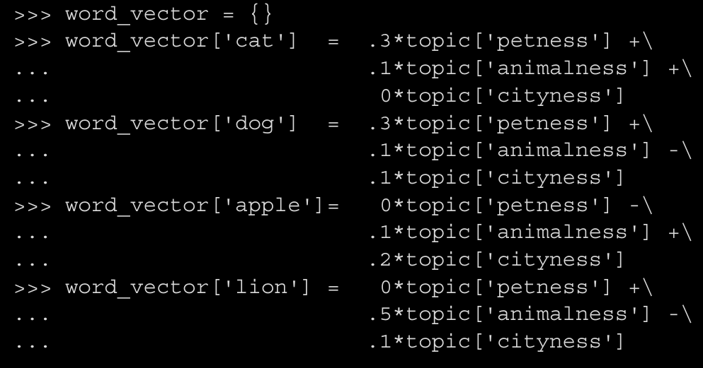

## Intro

- In this chapter will start learning about how machines can understand the meaninig of words

- TF-IDF helped estimate importance of words
- Those were greate for searchin text knowing the exact word or n-gram

- LSA or latenet semantuc analysis allows understanding semantics

- This chapter is about these semantic and topic vectors

## 4.1 From word counts to topic scores:

### 4.1 TF-IDF vectors and lemmmatization:

- In chapter 2, we cleaned the text removed the endings to get a single token, we used normalizations techniques.
- This lemmatization approach kept similarly spelled words together but **Not Meanings**

- This results in similar vectors not being similar in meaning but similar in spelling

### 4.2 Topic Vectors:

- Doing math on TF-IDF Vectors the results only tell about the frequemcy of the words uses in the documents.

- We need a way ti extact some additional info, meaning 
- It would be a vector that is more meaninigfull, and compact (less sparse)

- We call these meaningful vectors **word-topic vectors**
- We call the document meaninig vectors **document-topic vectors**
- Mathematical ops on these vectors are meaningfull
- the distances mean a lot more than they did in TD-IDF, usefull for clusting documents, or semantic search

- When done we have one document-topic vector for each doc
- More importantly, we don't have to reprocess the entire corpus to compute a new topuc vector for a new doc or phrase

- each word will have a word topic
- So document-topic vectors are the sum or all word-topic vectors in the doc

> **_Polysemy:_** Refers to the existence of words and phrases with more than one meaning

- LSA avoids all the problems caused by **Polysemy**

### 4.1.3: Thaught experiment:

We could craft some topics and classify the words in the corpus to the topics and assign weights as follows:

This representaion can be transposed to produce:

- These are the word vectors

### 4.1.4: An algorithm for scoring topics:

- We need an algorithnic way to determine these topic vectors instead of assignin them by a human
- A transformation from TF-IDF vectors into topic vectors could help

- **Counting Co-occurence** is a good way to start finding the meanings between words

- LSA is an efficient way to to gather up words into topics
- It can be seen as a dimensionality reduction techinque
- It is basically the same thing as PCA but applied for TD-IDF or Bag of word representations

> LSA Cousins:
Two Algorithms that are similar to LSA Are:
- Linear Discriminant analysis LDA
    - Breaks down documents to one topic
- Latenet Dirichlet Allocations LDiA
    - Breaks down documents to as many topics as needed

